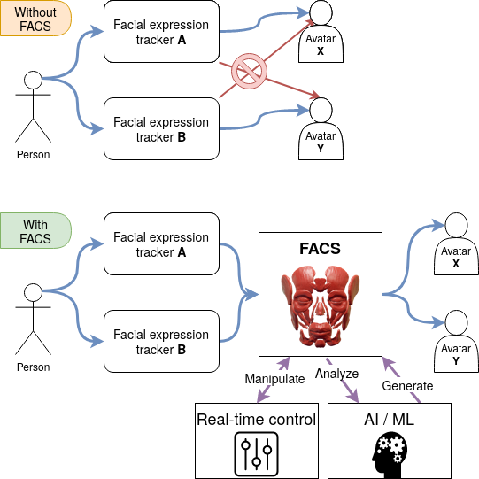

# What is FACSvatar? (v0.4.0-Alpha)
> FACSvatar is An Open Source Modular Framework for Real-Time FACS based Facial Animation

Or in plain English:

> Track facial expressions with any software and visualize that data on any avatar in real-time,
powered by the FACS representation.
No more need to modify your avatar to support your tracking software.
All written in your favorite programming language, on any OS, and across machines.

Muscle [image source](https://pixabay.com/illustrations/skull-anatomy-skull-and-crossbones-3012250/).

- Facial Action Coding System (**FACS**): A description of how muscle groups in the human face contract/relax
  to make any facial configuration possible.
  ([learn more](https://facsvatar.readthedocs.io/en/latest/facs_theory.html)).
  * Action Unit (**AU**): The strength of contraction of a single muscle group.
- **Modular**: Software and OS independent. You only need to know what data goes in and what comes out.
- **Extendable**: Write your code, add a ZeroMQ message socket, and let it talk to other modules.
- **Real-time**: Create lively avatars that respond to your user.
- **Machine/Deep Learning**: Input/output data-fied facial configurations.

(Above demo video link: https://www.youtube.com/watch?v=J2FvrIl-ypU)

Message to:
- **Animators**: Copy facial expressions from a video/webcam to your avatar.
- **Affective Computing**: Enable Human-Agent Interaction (HAI) by inputting your human-analysis into a ML-model,
output FACS values, and have your Embodied Conversational Agent (ECA) display it.
- **Psychologists**: Create stimuli with the same facial configurations across avatars of different sex, age and ethnicity.

FACSvatar is already operable with:
- Tracking software:
  * [OpenFace](https://github.com/TadasBaltrusaitis/OpenFace): Extract facial AUs from videos/webcam.
- Visualization software:
  * [Blender 2.80+](https://www.blender.org/)
    * [MB-Lab](https://mb-lab-community.github.io/MB-Lab.github.io/) 3D avatar generation
  * [Unity3D](https://unity.com/)
  * [FACSHuman](https://www.michaelgilbert.fr/facshuman/)
- Modules for additional data processing, and allowing `m trackers - to - n avatars` (`modules` folder)
- [ZeroMQ](https://zeromq.org/): This framework's glue, allowing modules to communicate with each other.
- [Containerization with Docker](https://www.docker.com/) to run FACSvatar modules everywhere.

**Disclaimers**: This is an open-source project, hopefully being flexible enough for your facial animation needs.
This is not software supported by a company / commercially, but by users like you.
If you need some new capability, you likely have to code it yourself (or ask/hire someone),
but questions for guidance are always welcome (make a [GitHub issue](https://github.com/NumesSanguis/FACSvatar/issues))!
For commercial usage, please check the [license page](https://facsvatar.readthedocs.io/en/latest/misc/license.html).
Read more about FACSvatar's limitations (TODO doc link).

## Full documentation
Read the Docs: https://facsvatar.readthedocs.io/

## Paper
Please cite the following paper when using this framework in a paper:

[van der Struijk, Stef and Huang, Hung-Hsuan and Mirzaei, Maryam Sadat and Nishida, Toyoaki "FACSvatar: An Open Source Modular Framework for Real-Time FACS based Facial Animation" In Proceedings of 18th ACM International Conference on Intelligent Virtual Agents (pp. 159-164). ACM, 2018.](https://dl.acm.org/citation.cfm?id=3267918)

- DOI: https://doi.org/10.1145/10.1145/3267851.3267918
- ISBN: 978-1-4503-6013-5/18/11

## New in v0.4.0-alpha (2020-07-??)  TODO UNFINISHED

* COMPLETE re-write of the documentation: [Check it out!](https://facsvatar.readthedocs.io/en/v0.4.0/)
* Python modules:
    * Standardization pass over all modules / code clean-up
    * Consistency fix: ROUTER / DEALER sockets use JSON formatted data
    * DOC string per class and function
    * Logger instead of print() statements
    * Debug as option to enable logger
    * File structure for proper import of modules / pip?
    * Use config file (in addition to command line arguments) + config filepath argument
* Easy run: Docker container per module + Docker Compose
* Demo video

See [all changelogs](https://facsvatar.readthedocs.io/en/latest/changelog.html)

# Quickstart
FACSvatar is tested on Ubuntu and Windows, but should work on MacOS.

This quickstart has 2 parts:
1. Start FACSvatar modules using Docker - modules in containers
(see [here for Python instructions](https://facsvatar.readthedocs.io/en/latest/firstrun))
2. Visualize in Unity3D or Blender

## Dockerized modules
<!-- 

Expand (CLICK ME)

 -->

0. Downloads - Go to the [release page of this GitHub repo](https://github.com/NumesSanguis/FACSvatar/releases) and download:
    * (Real-time only) openface_2.1.0_zeromq.zip
        * Unzip and execute `download_models.sh or .ps1` to download trained models
    * Windows 7 / 8 / 10 Home version <2004 : unity_FACSvatar_standalone_docker-ip.zip
    * Windows 10 Home v2004+ / Pro / Enterprise / Education: unity_FACSvatar_standalone.zip
    * Windows / Linux / Mac: [Unity3D editor (documentation)](https://facsvatar.readthedocs.io/en/latest/defaultsetup.html#unity3d-game-engine)
    * Source code (zip / tar.gz) or download this repository with:
        * `git clone https://github.com/NumesSanguis/FACSvatar.git`
        * Press the green `Clone or Download` button on this page --> `Download ZIP`

1. Docker Install - Let's you execute applications without worrying about OS or programming language.
    * [General Docker instructions](https://docs.docker.com/install/#supported-platforms)
    * [Docker Toolbox for Windows 7/8/10 Home version <2004](https://docs.docker.com/toolbox/overview/)
    * [Docker for Windows 10 Home v2004+](https://docs.docker.com/docker-for-windows/install-windows-home/)
    * [Docker for Windows 10 Pro, Enterprise or Education](https://docs.docker.com/docker-for-windows/install/#what-to-know-before-you-install)
    * Ubuntu: [Docker](https://docs.docker.com/install/linux/docker-ce/ubuntu/) and [docker-compose](https://docs.docker.com/compose/install/) and `sudo usermod -a -G docker $USER`

2. Docker Modules - Open a terminal (W7/8: cmd.exe / W10: PowerShell) and navigate to folder `FACSvatar/modules`, then execute:
    1. `docker-compose pull`  (Downloads FACSvatar Docker containers)
    2. `docker-compose up`  (Starts downloaded Docker containers)
    
3.  See visualization engine instructions

### Offline version:

4. Open a 2nd terminal in folder `FACSvatar/modules` and execute: `docker-compose exec facsvatar_facsfromcsv bash`
5. Inside Docker container - Start facial animation with: `python main.py --pub_ip facsvatar_bridge`

### With webcam for real-time (Windows-only for now):

4. Navigate inside folder `openface_x.x.x_zeromq`
5. (Windows 7/8/10 Home version <2004 - only) Get Docker machine ip by opening a 2nd terminal and execute: `docker-machine ip` (likely to be 192.168.99.100)
6. (Windows 7/8/10 Home version <2004 - only) Open `config.xml`, change `<IP>127.0.0.1</IP>` to `<IP>machine ip from step 3</IP>` (`<IP>192.168.99.100</IP>`) and save and close.
7. Double click `OpenFaceOffline.exe` –> menu: File –> Open Webcam

<!--  

  -->

## Visualization engines
### Unity3D
Tested on version: 2018.2.20f1

1. Open the folder `unity_FACSvatar` as a project with Unity3D
2. Press play (now it's waiting for facial data)

OR (Windows-only TODO):

1. Navigate inside unzipped folder unity_FACSvatar_standalone(_docker-ip) and double-click `unity_FACSvatar.exe`

Extra: Use the numbers 0, 1, 2 on your keyboard to change camera.

### FACSvatar Blender add-on
Follow instructions here: https://github.com/NumesSanguis/FACSvatar-Blender

## Quickstart video
See the quickstart video (:warning: note that the **Blender script part is outdated** (from 15:15) due the new FACSvatar Blender add-on):

# Find out more
## Full documentation
[Read the FACSvatar documentation](https://facsvatar.readthedocs.io/en/latest/)!

## 2017 promotion poster (English & 日本語)

